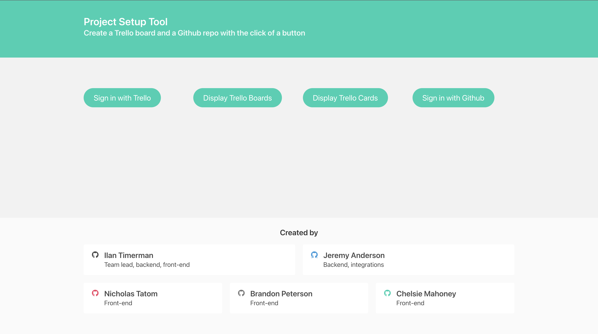

#  Project Setup Tool

A tool to automatically set up a Trello board and a GitHub repo for collaborative projects.

## Built With
* HTML
* CSS
* JS
* XML

## Authors

* Ilan Timerman  (https://github.com/ilantimerman)  
* Jeremy Anderson  (https://github.com/jeremy0anderson)  
* Nicholas Tatom  (https://github.com/tatomtech)  
* Brandon Peterson  (https://github.com/Brandonpeterson6)  
* Chelsie Mahoney  (https://github.com/CMahoney12)  

## Screenshot

## Deployment 
You can find our deployed project here: (https://ilantimerman.github.io/project-setup-tool/)  
You can find the Repostitory here: (https://github.com/ilantimerman/project-setup-tool)
